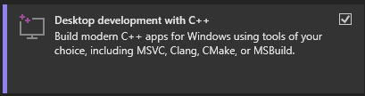
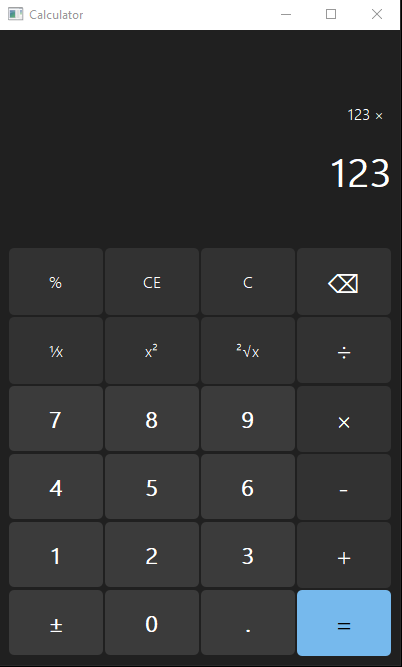

# PyQt5 Calculator
I made this Calculator as my first project so ignore the messy code that i made because im still a beginner at coding

# Requirements
For my calculator to work you need to install [Python](https://python.org), Since my calculator depends on PyQt5 to work

Then after you done installing it you need to install PyQt5 with the following commands with terminal
```sh
$ pip install PyQt5
```

# Issues
if you encountered a error during a installation that say like
```
Microsoft Visual C++ 14.0 or greater is required
```

Then you need to install [Microsoft Visual Studio Build Tools](https://visualstudio.microsoft.com/visual-cpp-build-tools/)

and then select this



and then click install after that try type in the following command again with terminal
```sh
$ pip install PyQt5
```

And then run the `main.py` in your IDE

# Preview Calculator


# Disclaimer
There is a highly chance that there is a bug on the calculator because it's my first project
